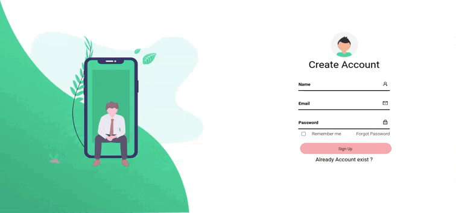

# Todo (Backend And Frontend)

Todo full-stack application is built using a combination of technologies to handle both the server-side and client-side development. It leverages Node.js, a powerful JavaScript runtime, and Express.js, a web application framework, to handle the server-side logic and API endpoints. On the client-side, React.js, a popular JavaScript library for building user interfaces, is used to create a dynamic and responsive user experience.

Node.js and Express.js handle the backend logic, including API endpoints, authentication, database interactions, and business logic implementation. Mongoose acts as the bridge between the application and the MongoDB database, allowing easy modeling and querying of data. On the client-side, React.js takes care of rendering the user interface, handling user interactions, and communicating with the server through API requests.

## API Reference

### Aunthication :

#### Sign Up

```http
  POST /api/v1/auth/sign_up
```

| Parameter  | Type     | Description |
| :--------- | :------- | :---------- |
| `email`    | `string` | Required    |
| `name`     | `string` | Required    |
| `password` | `string` | Required    |

#### Sign In

```http
  Get /api/v1/auth/sign_in
```

| Parameter  | Type     | Description |
| :--------- | :------- | :---------- |
| `email`    | `string` | Required    |
| `password` | `string` | Required    |

### Authorization :

#### Get Current Log In User Info

```http
  GET /api/v1/who_am_i
```

| Parameter | Type     | Description                                     |
| :-------- | :------- | :---------------------------------------------- |
| `auth`    | `string` | **Required**. Token For Authorization In Header |

### Todo :

#### Get all todo list

```http
  GET /api/v1/todo/get
```

| Parameter | Type     | Description                                     |
| :-------- | :------- | :---------------------------------------------- |
| `auth`    | `string` | **Required**. Token For Authorization In Header |

#### Add Todo

```http
  POST /api/v1/todo/add
```

| Parameter | Type     | Description                                     |
| :-------- | :------- | :---------------------------------------------- |
| `auth`    | `string` | **Required**. token For Authorization In Header |

#### Modify One Todo

```http
  PUT /api/v1/todo/`${id}`
```

| Parameter | Type     | Description                                     |
| :-------- | :------- | :---------------------------------------------- |
| `auth`    | `string` | **Required**. token For Authorization In Header |
| `id`      | `string` | **Required**. id in param For Modify Todo       |

#### Delete One Todo

```http
  Delete /api/v1/todo/`${id}`
```

| Parameter | Type     | Description                                     |
| :-------- | :------- | :---------------------------------------------- |
| `auth`    | `string` | **Required**. token For Authorization In Header |
| `id`      | `string` | **Required**. id in param For Delete            |

## Tech Stack

**Client:**

| dependencies       | Version     | Description                                                                                                    |
| :----------------- | :---------- | :------------------------------------------------------------------------------------------------------------- |
| `@chakra-ui/react` | `^2.6.1`    | Chakra UI is a simple, modular and accessible component library that gives you the building React applications |
| `@emotion/react`   | `^11.11.0`  | Emotion is a library designed for writing css styles with JavaScript.                                          |
| `@emotion/styled`  | `^11.11.0`  |                                                                                                                |
| `axios`            | `^1.4.0"`   | Promise-based HTTP Client for node.js and the browser                                                          |
| `framer-motion`    | `^10.12.10` | simple and powerful React and JavaScript animation library                                                     |

**Server:**
| dependencies | Version | Description |
| :-------- | :------- | :-------------------------------- |
| `mongodb` | `^5.2.0` | MongoDB is a cross-platform document-oriented database program. |
| `express` | `^4.18.2` | is a back end web application framework for building RESTful APIs with Node.js. |
| `mongoose` | `^7.0.3` | mongoose is a JavaScript object-oriented programming library that creates a connection between MongoDB and the Node.js JavaScript runtime environment |
| `bcryptjs` | `^2.4.3` | to hash and verify passwords in Node. js.|
|`cors`| `^2.8.5` | CORS is a node.js package for providing a Connect/Express middleware that can be used to enable CORS with various options.
|`dotenv`|`^16.0.3`| loads environment variables from a .env file into process.env. Storing configuration in the environment separate from code is based on The Twelve-Factor App methodology.
|`jsonwebtoken`|`^9.0.0`| JSON Web Token is a proposed Internet standard for creating data with optional signature and/or optional encryption whose payload holds JSON that asserts some number of claims. The tokens are signed either using a private secret or a public/private key.
|`helmet`| `^6.1.5` | helps secure Express apps by setting HTTP response headers.
|`morgan` | `1.10.0` | HTTP request logger middleware for node.js |

## Run Locally

Clone the project

```bash
  git clone https://github.com/hellojyoti01/todo_fullstack-red-apple-task.git
```

Go to the project directory

```bash
  cd
```

Install dependencies

```bash
   yarn install
```

Start the server

```bash
  yarn dev
```

## Demo



## Documentatio

https://scribehow.com/shared/How_to_Sign_Up_and_Create_a_Contact_Form__dUy_XHJxTVKGLhHVCuWtaA

## Environment Variables

To run this project, you will need to add the following environment variables to your .env file

`PORT`=`6050`

`ENVIROMENT`=`DEVELOPEMENT`

`PASSWORD`=`mongodbPassword`

`JWT_KEY`=`hellosecreate`

## Features

- user create account and sign in
- Fullscreen mode
- Responsive for max device
- Cross platform
- add, get, modifay, delete Todo

## Badges

Add badges from somewhere like: [shields.io](https://shields.io/)

[](https://choosealicense.com/licenses/mit/)
[](https://opensource.org/licenses/)
[](http://www.gnu.org/licenses/agpl-3.0)

### Hi 👋, I'm Jyotiprakash Panigrahi

A passionate frontend and Backend 👨‍💻 🚀 developer from India

- 🔭 I’m currently working on [FullStack Project](https://github.com/hellojyoti01/backend-social-tech_)

- 🌱 I’m currently learning NodeJS and MongoDB

- ❓ Ask me about anything related to MERN stack and related technologies

- 📫 How to reach me **jyotiprakash.panigrahi055@gmail.com**

- 📄 Know about my experiences [https://drive.google.com/file/d/1zG-IHLqs93fEV5-rJOh8MP-z7Tdy_ozR/view?usp=sharing](https://drive.google.com/file/d/1zG-IHLqs93fEV5-rJOh8MP-z7Tdy_ozR/view?usp=sharing)

- ⚡ Fun fact: I use tabs over spaces

## 🔗 Links

[](https://hellojyoti01.github.io/portfolio_website/)

[](https://www.linkedin.com/in/hellojyoti/)

## Authors

- [@hellojyoti01](https://github.com/hellojyoti01/)

## License

[MIT](https://choosealicense.com/licenses/mit/)

## Documentation

[Documentation](https://scribehow.com/shared/How_to_Sign_Up_and_Create_a_Contact_Form__dUy_XHJxTVKGLhHVCuWtaA)
